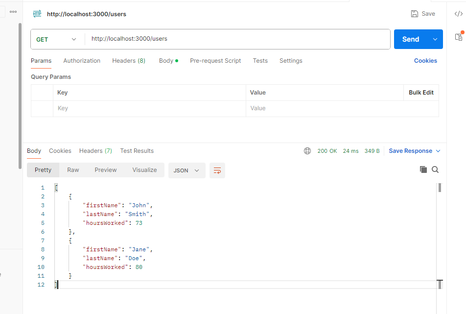
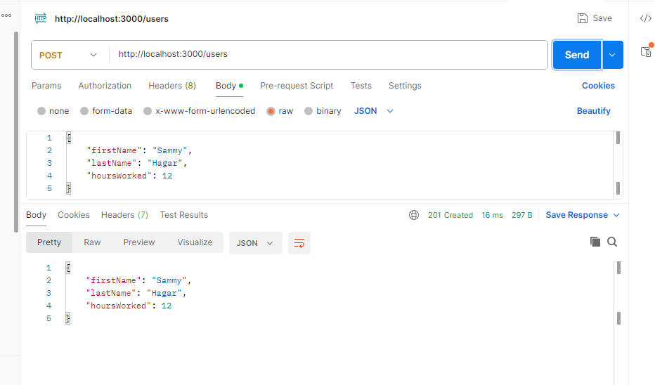

# Spring Boot Microservices - Lab 1
In this lab, you will run a node based microservice then add a Java SpringBoot microservice and test them both in Postman.
## Part 1
1. Open PowerShell. The icond should be in your task bar.
2. Change into the `lab-1` folder.
3. Run `ls` to view the contents of the folder.

```
├── employee-timesheet
│   ├── public
│   ├── routes
│   ├── .dockerignore
│   ├── .gitignore
│   ├── app.js
│   ├── Dockerfile
│   ├── package.json
│   └── README.md
└── README.md
```
4. Run the microservice: 
```powershell
docker compose up --build
```

When docker compose runs, it will build and spin up the timesheet-api service, but not the others. You will edit the docker compose file to add the Spring Boot service in a moment. For now, we'll test the service with Postman.
Once you have built with docker compose, you don't have to again until you change the code.
## Part 2
Open Postman, the icon should be on your desktop. Once loaded, we will get the employees from the service. There is no backing database, so the employee list will reset on each restart of this system.
1. Run postman. Use minimal mode. It is not necessary to login.
2. Enter a GET at http://localhost:3000/users and see the results.



3. Next, POST a user to the same URL.



4. Finally, run the GET again and observe your new record is listed.
## Part 3
The final part of this lab is to observe the pattern laid out for the timesheet-api and add the payroll-api to the docker-compose.yml file. Use Postman to get http://localhost/8080/api/employees/api and verify it is working.
## Conclusion
In this lab you ran a simple node express based microservice, then added a Java based microservice to the infrastructure. This is an example of polygot architecture.